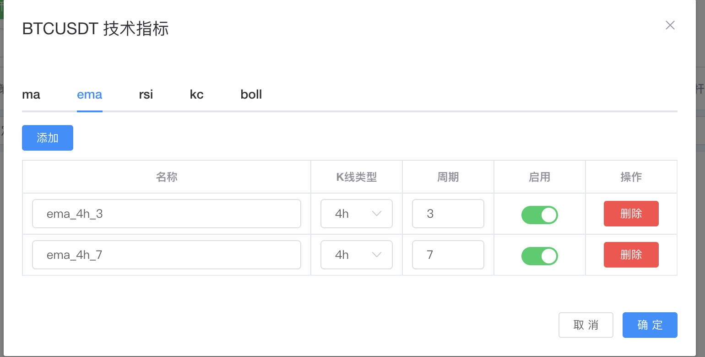
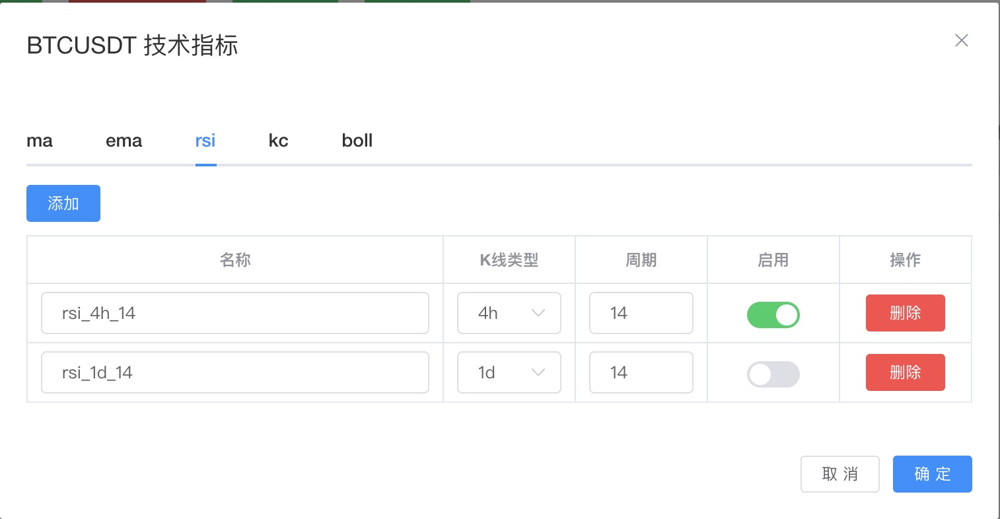

# 如何使用自定义策略

## 首先类型需要选择为自定义


## 然后需要定义技术指标
> 目前支持的指标有 `ma`, `ema`, `rsi`, `kc(肯纳特通道)`, `boll(布林带)`

- 示例图




### 名称
> 当前指标起一个名字 `必须在当前栏目下唯一`(写策略时需要用到)

### k线类型
> k线的周期类型选择

### 其它输入
> 指标相关的标准参数

### 启用
> 只有选择了开启的指标才可以在策略中使用

## 最后编写策略

- 示例图


### 名称
> 策略起一个名字

### 代码
> 自定的策略逻辑, 后面会讲如何编写

### 类型
> 做多 或 做空

### 启用
> 有选择了开启,才会真正使用

## 指标和代码逻辑说明

### ema 指标实例说明
> 假如我们在 ema 的栏目下面定义了 2 行数据如下:


| 名称  |  k线类型 | 周期  | 启用  |
| ------------ | ------------ | ------------ | ------------ |
| ema_4h_3  | 4h  | 4  | true |
| ema_4h_7  | 4h  | 7  | true |

>代表程序会创建 `ema["ema_4h_3"] = [32.3, 43.3, ...]` 和 `ema["ema_4h_7"] = [32.3, 33.3, ...]` 的 `150` 条数据的变量，分别对应 `ema` 的每个时刻点的数据，排序方式从时间维度来说，从最新到最旧(`ema["ema_4h_3"][0]` 是当前时刻的 `ema` 数据)

### 策略实例说明
> 根据上面的 `ema` 实例，我们来写一个简单的策略，具体如下

```
ema["ema_4h_3"][1] < ema["ema_4h_7"][1] && ema["ema_4h_3"][0] > ema["ema_4h_7"][0]
```

> 我们来解释一下，`ema_4h_3` 是一条 `ema` 的短线，`ema_4h_7` 是一条 ema 的长线(相对于 `ema_4h_3` 来说)，所以上面这个策略的的含义就是前一个时刻的`短线`在`长线`下方，当前时刻的`短线`在`长线`上方, 从术语上来说这是一个金叉，是一个`做多`的趋势策略

### 所有指标实例说明

#### nowPrice
> 内置变量: 可以在策略中使用 `nowPrice` 来代指某个币的当前价格

#### ma

| 名称  |  k线类型 | 周期  | 启用  |
| ------------ | ------------ | ------------ | ------------ |
| ma1  | 4h  | 14  | true |

> 程序创建 `ma["ma1"] = [23.2, 34.2, ...]` 的 `150` 条数据变量，使用方式是 `ma["xxx_name"]`

#### ema

| 名称  |  k线类型 | 周期  | 启用  |
| ------------ | ------------ | ------------ | ------------ |
| ema1  | 4h  | 14  | true |

> 程序创建 `ema["ema1"] = [23.2, 34.2, ...]` 的 `150` 条数据变量，使用方式是 `ema["xxx_name"]`

#### rsi

| 名称  |  k线类型 | 周期  | 启用  |
| ------------ | ------------ | ------------ | ------------ |
| rsi1  | 4h  | 14  | true |

> 程序创建 `rsi["rsi1"] = [67.2, 82.2, ...]` 的 `150` 条数据变量，使用方式是 `ema["xxx_name"]`

#### kc

| 名称  |  k线类型 | 周期  | 多元  | 启用 |
| ------------ | ------------ | ------------ | ------------ | ------------ |
| kc_1  | 4h  | 50  | 2.75 | true |


> 程序创建 `kc["kc_1"].High = [67.2, 82.2, ...]` , `kc["kc_1"].Mid = [57.2, 77.2, ...]` , `kc["kc_1"].Low = [47.2, 42.2, ...]` 的 `150` 条数据的 3 个变量
> 使用方式: 上轨数据 `kc["xxx_name"].High`,  中轨数据 `kc["xxx_name"].Mid`, 下轨数据 `kc["xxx_name"].Low`

#### boll

| 名称  |  k线类型 | 周期  | 带宽  | 启用 |
| ------------ | ------------ | ------------ | ------------ | ------------ |
| boll_1  | 4h  | 21  | 2 | true |


> 程序创建 `boll["boll_1"].High = [67.2, 82.2, ...]` , `boll["boll_1"].Mid = [57.2, 77.2, ...]` , `boll["boll_1"].Low = [47.2, 42.2, ...]` 的 `150` 条数据的 3 个变量
> 使用方式: 上轨数据 `boll["xxx_name"].High`,  中轨数据 `boll["xxx_name"].Mid`, 下轨数据 `boll["xxx_name"].Low`