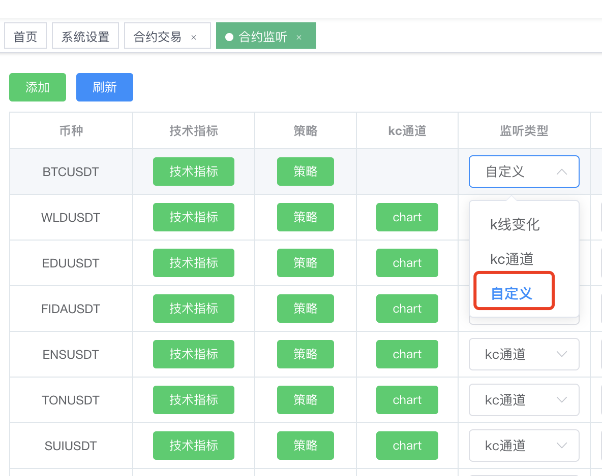
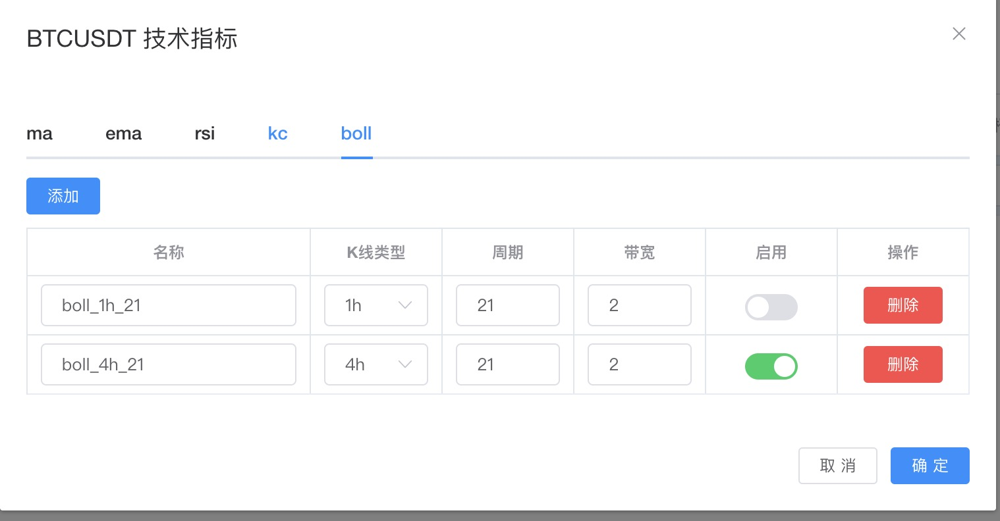
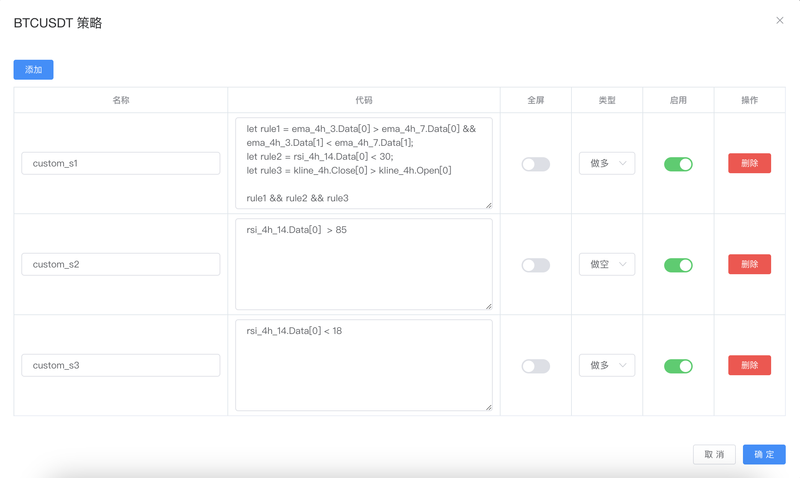
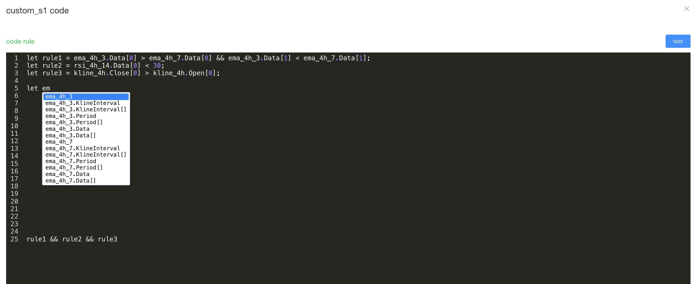

# 如何使用自定义策略

## 首先类型需要选择为自定义




## 然后需要定义技术指标
> 目前支持的指标有 `ma`, `ema`, `rsi`, `kc(肯纳特通道)`, `boll(布林带)`, `atr`

- 示例图




### 名称
> 当前指标起一个名字 `必须所有栏目下唯一`(写策略时需要用到)

### k线类型
> k线的周期类型选择

### 其它输入
> 指标相关的标准参数

### 启用
> 只有选择了开启的指标才可以在策略中使用

## 最后编写策略
> !!! 策略的逻辑最终必须是 `true` 或 `false` !!!



### 名称
> 策略起一个名字

### 代码
> 自定的策略逻辑, 后面会讲如何编写

### 类型
> 做多 或 做空

### 启用
> 有选择了开启,才会真正使用

## 指标和代码逻辑说明

### ema 指标实例说明
> 假如我们在 ema 的栏目下面定义了 2 行数据如下:


| 名称  |  k线类型 | 周期  | 启用  |
| ------------ | ------------ | ------------ | ------------ |
| ema_4h_3  | 4h  | 4  | true |
| ema_4h_7  | 4h  | 7  | true |

>代表程序会根据`名称`创建 `ema_4h_3` 和 `ema_4h_7` 的变量，具体内容如下:

```
ema_4h_3.KlineInterval // 4h
ema_4h_3.Period // 4
ema_4h_3.Data = [30.2, 30.3, ..] // 150 count, 分别对应 `ema` 的每个时刻点的数据，排序方式从时间维度来说，从最新到最旧(ema_4h_3.Data[0] 是当前时刻的 `ema` 数据)

ema_4h_7.KlineInterval // 4h
ema_4h_7.Period // 7
ema_4h_7.Data = [33.2, 35.3, ..]
```

### 策略实例说明
> 根据上面的 `ema` 实例，我们来写一个简单的策略，具体如下

```
ema_4h_3.Data[0] > ema_4h_7.Data[0] && ema_4h_3.Data[1] < ema_4h_7.Data[1]
```

> 我们来解释一下，`ema_4h_3` 是一条 `ema` 的短线，`ema_4h_7` 是一条 ema 的长线(相对于 `ema_4h_3` 来说)，所以上面这个策略的的含义就是前一个时刻的`短线`在`长线`下方，当前时刻的`短线`在`长线`上方, 从术语上来说这是一个金叉，是一个`做多`的趋势策略

### 代码详细说明
> 策略代码编写规范，需要参考 https://expr-lang.org/docs/language-definition#now

#### 支持自动补全功能(Tab)
> 

#### 内置变量

##### NowPrice
###### 类型: float64
###### 含义: 某个币的当前价格

##### SystemStartTime
###### 类型: int
###### 含义: 系统开启的毫秒时间戳

##### NowTIme
###### 类型: int
###### 含义: 当前时间的毫秒时间戳


#### 内置函数
> https://expr-lang.org/docs/language-definition#array-functions

##### 其它函数

###### Kdj

```
/**
 * 是否只产生过一次金叉(短线穿越长线一次，没有反复穿越)
 * @param ma1 短线
 * @param ma2 长线
 * @param num 检查数量
 * @returns Boolean
 */
func Kdj(ma1 []float64, ma2[]float64, num int) bool 
```

###### IsDesc

```
// 是否是一个降序数组
func IsDesc(arr []float64) bool
```

###### IsAsc

```
// 是否是一个升序数组
func IsAsc(arr []float64) bool
```

#### 技术指标生成的变量

##### ma

| 名称  |  k线类型 | 周期  | 启用  |
| ------------ | ------------ | ------------ | ------------ |
| ma1  | 4h  | 14  | true |


```
ma1.KlineInterval // 4h
ma1.Period // 14
ma1.Data = [30.2, 30.3, ..] // 150 count
```


##### ema

| 名称  |  k线类型 | 周期  | 启用  |
| ------------ | ------------ | ------------ | ------------ |
| ema1  | 4h  | 14  | true |

```
ema1.KlineInterval // 4h
ema1.Period // 14
ema1.Data = [30.2, 30.3, ..] // 150 count
```

##### rsi

| 名称  |  k线类型 | 周期  | 启用  |
| ------------ | ------------ | ------------ | ------------ |
| rsi1  | 4h  | 14  | true |

```
rsi1.KlineInterval // 4h
rsi1.Period // 14
rsi1.Data = [67.2, 70.3, ..] //  < 150 count
```

##### kc

| 名称  |  k线类型 | 周期  | 多元  | 启用 |
| ------------ | ------------ | ------------ | ------------ | ------------ |
| kc_1  | 4h  | 50  | 2.75 | true |

```
kc_1.KlineInterval // 4h
kc_1.Period // 50
kc_1.Multiplier // 2.75
kc_1.High = [67.2, 70.3, ..]
kc_1.Mid = [57.2, 50.3, ..]
kc_1.Low = [37.2, 40.3, ..]
```

##### boll

| 名称  |  k线类型 | 周期  | 带宽  | 启用 |
| ------------ | ------------ | ------------ | ------------ | ------------ |
| boll_1  | 4h  | 21  | 2 | true |


```
boll_1.KlineInterval // 4h
boll_1.Period // 21
boll_1.StdDevMultiplier // 2
boll_1.High = [67.2, 70.3, ..]
boll_1.Mid = [57.2, 50.3, ..]
boll_1.Low = [37.2, 40.3, ..]
```

##### atr

| 名称  |  k线类型 | 周期  | 启用  |
| ------------ | ------------ | ------------ | ------------ |
| atr1  | 4h  | 14  | true |

```
atr1.KlineInterval // 4h
atr1.Period // 14
atr1.Data = [67.2, 70.3, ..] // 150 count
```

##### macd

| 名称  |  k线类型 | 快线周期  | 慢线周期  | 信号线周期 | 启用 |
| ------------ | ------------ | ------------ | ------------ | ------------ | ------------ |
| macd_1  | 4h  | 12  | 26 | 9 | true |

```
macd_1.KlineInterval // 4h
macd_1.FastPeriod // 12
macd_1.SlowPeriod // 26
macd_1.SignalPeriod // 9
macd_1.MACD = [0.12, -0.05, ..] // 150 count, MACD线 (快线EMA - 慢线EMA)
macd_1.Signal = [0.08, -0.02, ..] // 150 count, 信号线 (MACD线的EMA)
macd_1.Histogram = [0.04, -0.03, ..] // 150 count, 柱状图 (MACD线 - 信号线)
```

#### 其它

##### k 线数据
> 每当你定义了一个任意k线类型的指标时，会额外生成对应的k线数据的变量 `kline_{xx}`

| 名称  |  k线类型 | 周期  | 启用  |
| ------------ | ------------ | ------------ | ------------ |
| xxx  | 4h  | xxx  | true |

```
kline_4h.High = [67.2, 70.3, ..] // 150 count
kline_4h.Low = [27.2, 20.3, ..] // 150 count
kline_4h.Open = [37.2, 30.3, ..] // 150 count
kline_4h.Close = [47.2, 34.3, ..] // 150 count
kline_4h.Amount = [100.1, 100.2..] // 150 count 成交额
kline_4h.Qps = [10.31, 10.32..] // 150 count 单位时间的成交额
```

##### BTCUSDT 数据

```
BTCUSDT.PercentChange = 1.1 // 涨跌幅
BTCUSDT.Close = 70000.2 // 当前价格
BTCUSDT.Open = 71000.4 // 开盘价
BTCUSDT.Low = 65000.4 // 最低价
BTCUSDT.High = 75000.2 // 最高价
```

##### ETHUSDT 数据

```
ETHUSDT.PercentChange = -1.1 // 涨跌幅
ETHUSDT.Close = 2500.2 // 当前价格
ETHUSDT.Open = 2400.45 // 开盘价
ETHUSDT.Low = 2456.2 // 最低价
ETHUSDT.High = 2840.3 // 最高价
```

##### SOLUSDT data

```
SOLUSDT.PercentChange = -1.1 // 涨跌幅
SOLUSDT.Close = 200.2 // 当前价格
SOLUSDT.Open = 230.45 // 开盘价
SOLUSDT.Low = 143.2 // 最低价
SOLUSDT.High = 244.3 // 最高价
```

##### BNBUSDT data

```
BNBUSDT.PercentChange = -1.1 // 涨跌幅
BNBUSDT.Close = 600.2 // 当前价格
BNBUSDT.Open = 580.45 // 开盘价
BNBUSDT.Low = 578.2 // 最低价
BNBUSDT.High = 640.3 // 最高价
```

##### 所选币种的 数据

```
NowSymbolPercentChange = -1.1 // 涨跌幅
NowSymbolClose = 2500.2 // 当前价格
NowSymbolOpen = 2400.45 // 开盘价
NowSymbolLow = 2456.2 // 最低价
NowSymbolHigh = 2840.3 // 最高价
```

##### 当前仓位的持仓信息

```
ORI = 10.2 // 收益率%
Position.Symbol = "ETHUSDT" // 交易对
Position.EntryPrice = 2500.2 // 持仓价格
Position.MarkPrice = 2400.2 // 当前的标记价格
Position.Amount = 1.2 // 当前的持仓数量，做空是负数
Position.UnrealizedProfit = 32.2 // 当前收益 usdt, 亏损是负数
Position.Leverage = 3 // 杠杆
Position.Side = "LONG" // 合约方向
Position.Mock = false // 是否是 mock 的数据
Position.CreateTime = 1745070856000 // 毫秒时间戳
Position.SourceType = "local" or "api" // 数据来源，只有 local 才有 CreateTime
```

##### 基本趋势涨跌幅
>btc * 0.6 + eth * 0.3 + sol * 0.05 + bnb * 0.05

```
BasicTrend = 0.3
```