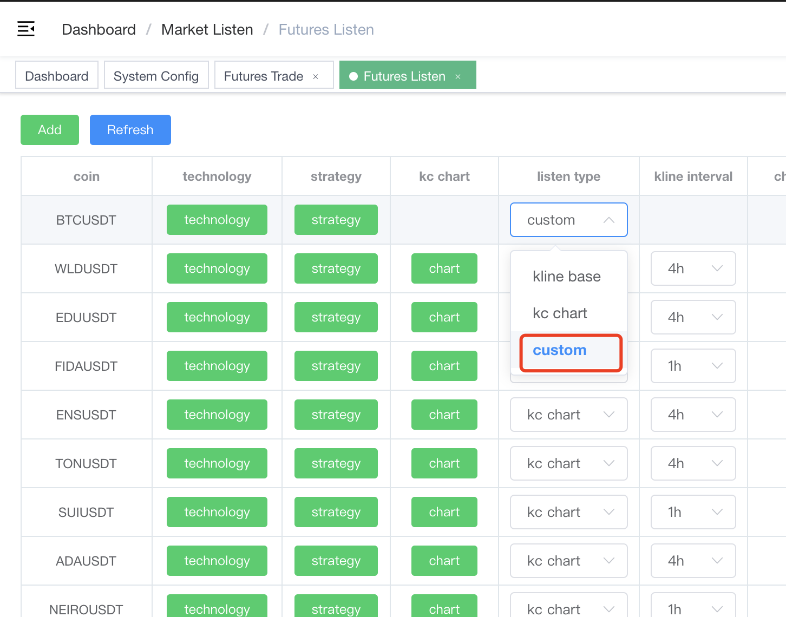
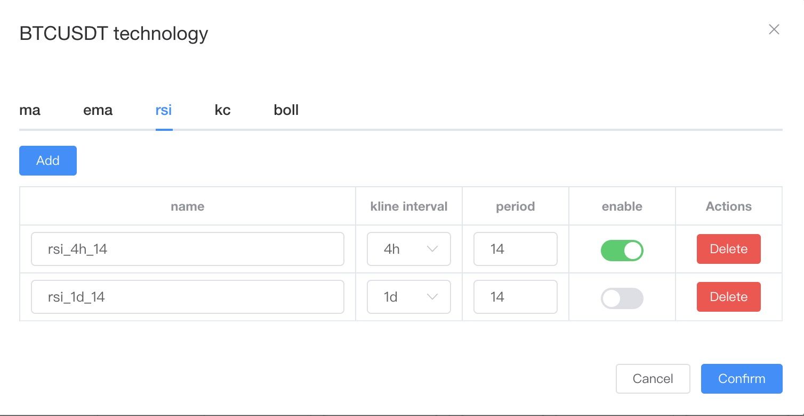

# How to use custom strategy

## Firstly, the type needs to be selected as custom




## Then it is necessary to define technical indicators
> The currently supported indicators are: `ma`, `ema`, `rsi`, `kc(keltner channels)`, `boll`

- example




### name
> The name of the current indicator must be unique in the current column (required when writing strategies)

### kline_interval
> kline_interval

### other params
> other params

### enable
> Only indicators that have been enabled can be used in the strategy

## Finally write the strategy

- example


### name
> Give a name to the strategy

### code
> Customize policy logic, we will explain how to write it later

### type
> long or short

### 启用
> Only when there is a choice to activate, can it truly be used

## technical indicator and code logic explanation

### ema technology demo
> If we define 2 rows of data under the column of EMA as follows:


| name  |  kline_interval | period  | enable  |
| ------------ | ------------ | ------------ | ------------ |
| ema_4h_3  | 4h  | 4  | true |
| ema_4h_7  | 4h  | 7  | true |

>The program will create 150 element length variables representing `ema["ema_4h_3"] = [32.3, 43.3, ...]` and `ema["ema_4h_7"] = [32.3, 33.3, ...]`, corresponding to each time point of `ema`, the sorting method is from the latest to the oldest in terms of time dimension (`ema["ema_4h_3"][0]` is the `ema` data at the current time)

### strategy demo
> Based on the `ema` technology demo above, let's write a simple strategy as follows:

```
ema["ema_4h_3"][1] < ema["ema_4h_7"][1] && ema["ema_4h_3"][0] > ema["ema_4h_7"][0]
```

>Let's explain that `ema_4h_3` is a short line of `ema`, and `ema_4h_7` is a long line of `ema` (relative to `ema_4h_3`). Therefore, the meaning of the above strategy is that the `short line` at the previous moment is below the `long line`, and the `short line` at the current moment is above the `long line`. In terms of terminology, this is a golden cross and a trend strategy of `long`

### Explanation of all technology indicator examples

#### nowPrice
> Built in variable: `nowPrice` can be used in the strategy to refer to the current price of a coin

#### ma

| 名称  |  k线类型 | 周期  | 启用  |
| ------------ | ------------ | ------------ | ------------ |
| ma1  | 4h  | 14  | true |

> The program will create 150 element length variables representing `ma["ma1"] = [23.2, 34.2, ...]`, the usage method is `ma["xxx_name"]`

#### ema

| 名称  |  k线类型 | 周期  | 启用  |
| ------------ | ------------ | ------------ | ------------ |
| ema1  | 4h  | 14  | true |

> 程序创建 `rsi["ema1"] = [23.2, 34.2, ...]` 的 `150` 条数据变量，可以供策略使用, the usage method is `ema["xxx_name"]`

#### rsi

| 名称  |  k线类型 | 周期  | 启用  |
| ------------ | ------------ | ------------ | ------------ |
| rsi1  | 4h  | 14  | true |

> The program will create 150 element length variables representing `rsi["rsi1"] = [67.2, 82.2, ...]`, the usage method is `rsi["xxx_name"]`

#### kc

| 名称  |  k线类型 | 周期  | 多元  | 启用 |
| ------------ | ------------ | ------------ | ------------ | ------------ |
| kc_1  | 4h  | 50  | 2.75 | true |

> The program will create 150 element length variables representing `kc["kc_1"].High = [67.2, 82.2, ...]` , `kc["kc_1"].Mid = [57.2, 77.2, ...]` , `kc["kc_1"].Low = [47.2, 42.2, ...]`
> Usage: Track data `kc["xxx_name"].High`,  middle track data `kc["xxx_name"].Mid`, down track data  `kc["xxx_name"].Low`

#### boll

| 名称  |  k线类型 | 周期  | 带宽  | 启用 |
| ------------ | ------------ | ------------ | ------------ | ------------ |
| boll_1  | 4h  | 21  | 2| true |


> The program will create 150 element length variables representing `ma["boll_1"].High = [67.2, 82.2, ...]` , `ma["boll_1"].Mid = [57.2, 77.2, ...]` , `ma["boll_1"].Low = [47.2, 42.2, ...]`
> Usage: Track data `boll["xxx_name"].High`,  middle track data `boll["xxx_name"].Mid`, down track data  `boll["xxx_name"].Low`